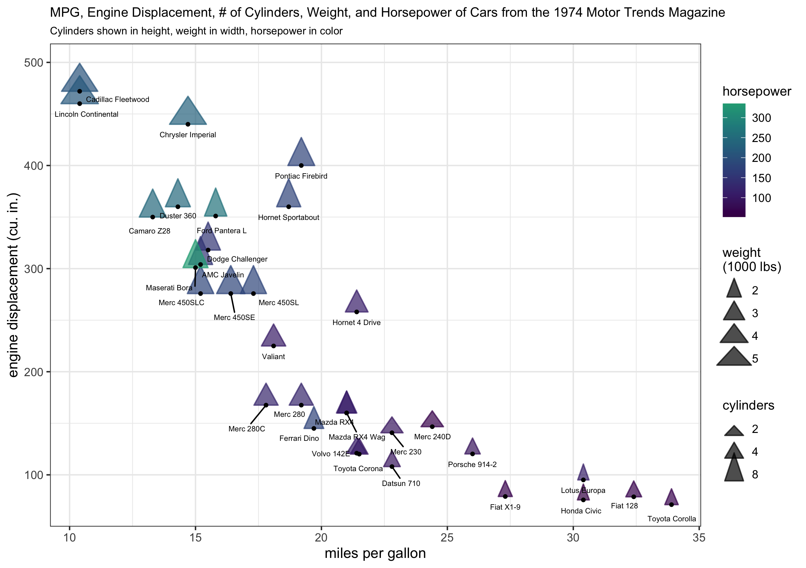

# ggtriangles

`ggtriangles` provides the `geom_triangles()` function which plots isosceles
triangles with their horizontal base centered at position `(x,y)` and variable
`triangle_height`, `triangle_width`, and `angle` as given by `aes()` arguments
in the `ggplot2` framework.

**note:** ggtriangles is still under development. 

### an example plot using ggtriangles

Here, the `triangle_height` argument is used to show the hypothesized effect of the 
drug (see details in `?datasets::sleep`) given on each individual. `ggtriangles`
supports the automatic creation of the legend shown here -- see how to make it 
in the [`vignette('intro-to-ggtriangles')`](vignettes/intro-to-ggtriangles.Rmd).

### basic usage

    library(ggtriangles)
    data.frame(x = seq(0,1,.1)) %>%
      ggplot(aes(x = x, y = x, triangle_height = x)) +
      geom_triangles()

The `geom_triangles()` layer takes aesthetic arguments for `triangle_height`,
`triangle_width`, and `angle` that can be mapped to data. Here, the x-axis,
y-axis, and `triangle_height` visual channels are all mapped to the same set of 
data.

### to install

    devtools::install_github("ctesta01/ggtriangles")

### some example plots using ggtriangles

Read about how to make these in the [`vignette('intro-to-ggtriangles')`](vignettes/intro-to-ggtriangles.Rmd).

### how to get started

Check out the examples available in the help pages by entering `?geom_triangles` into
R after you've loaded the package. Additionally, [`vignette('intro-to-ggtriangles')`](vignettes/intro-to-ggtriangles.Rmd)
has the code to produce the figures above.

I think ggtriangles will provide a nice interface both for Rtists who are
looking to incorporate triangles programmatically in their generative art, as
well as data visualization creators who are interested in using triangles'
position, height, width, color, and fill to communicate features of
their data.

### motivation

I originally created this because I wanted to be able to render something like
the NYTimes maps of where COVID-19 death rates had increased and decreased since
vaccines were widely made available to adults.

#### original nytimes version:

These maps were originally featured here: <https://www.nytimes.com/interactive/2021/12/28/us/covid-deaths.html> 

I spent some time re-creating something similar (though not exactly the
same) as the NYTimes analysis and graphic to demonstrate that functionality and
use-case for `ggtriangles`.

#### ggtriangles version:

You can check out how I did it in the vignette available through the vignette
available in `browseVignettes('ggtriangles')` or the source code,
[vignettes/recreating_nytimes_viz.Rmd](vignettes/recreating_nytimes_viz.Rmd).
Note that these figures are provided purely as examples and not meant for
decision making purposes or scientific usage. I'm pleased with how well I was
able to replicate their plot of where death rates had increased, but I can't say
for sure why I appear to be getting much larger decreases in the COVID-19 death
rates per 100,000 than they did in their analysis.

### feedback

Please feel free to make suggestions and provide feedback on ggtriangles in an
issue on this GitHub repository.
