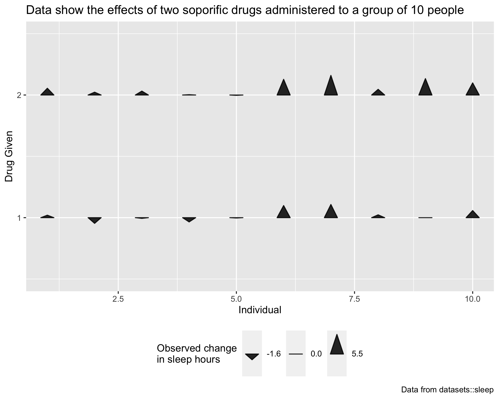

# ggtriangles

`ggtriangles` provides the `geom_triangles()` function which plots isoceles
triangles with a horizontal base centered at position `(x,y)` with height `z`.

**note:** ggtriangles is still under development.

### an example plot using ggtriangles

### to install

    devtools::install_github("ctesta01/ggtriangles")
    
### basic usage

    library(ggtriangles)
    data.frame(x = 1:5) %>%
      ggplot(aes(x = x, y = x, z = x)) +
      geom_triangles()

### how to get started

Check out the examples available in the help pages by entering `?geom_triangles` into
R after you've loaded the package.

### some more examples

The code for these is available in `?geom_triangles`.

ggtriangles also supports angles as well as transparency!

I think ggtriangles will provide a nice interface both for Rtists who are
looking to incorporate triangles programmatically in their generative art, as
well as data visualization creators who are interested in using triangles'
position, height, width, color, and fill to communicate features of
their data.

### motivation

I originally created this because I wanted to be able to render something like
the NYTimes maps of where COVID-19 death rates had increased and decreased since
vaccines were widely made available to adults.

#### origianl nytimes version:

These maps were originally featured here: <https://www.nytimes.com/interactive/2021/12/28/us/covid-deaths.html> 

I spent some time re-creating something similar (though not exactly the
same) as the NYTimes analysis and graphic to demonstrate that functionality and
use-case for `ggtriangles`.

#### ggtriangles version:

You can check out how I did it in the [`inst/recreate_nytimes_visualization_format.R`](inst/recreate_nytimes_visualization_format.R)
document. Note that these figures are provided purely as examples and not meant
for decision making purposes or scientific usage. 

### feedback

Please feel free to make suggestions and provide feedback on ggtriangles in an
issue on this GitHub repository.
