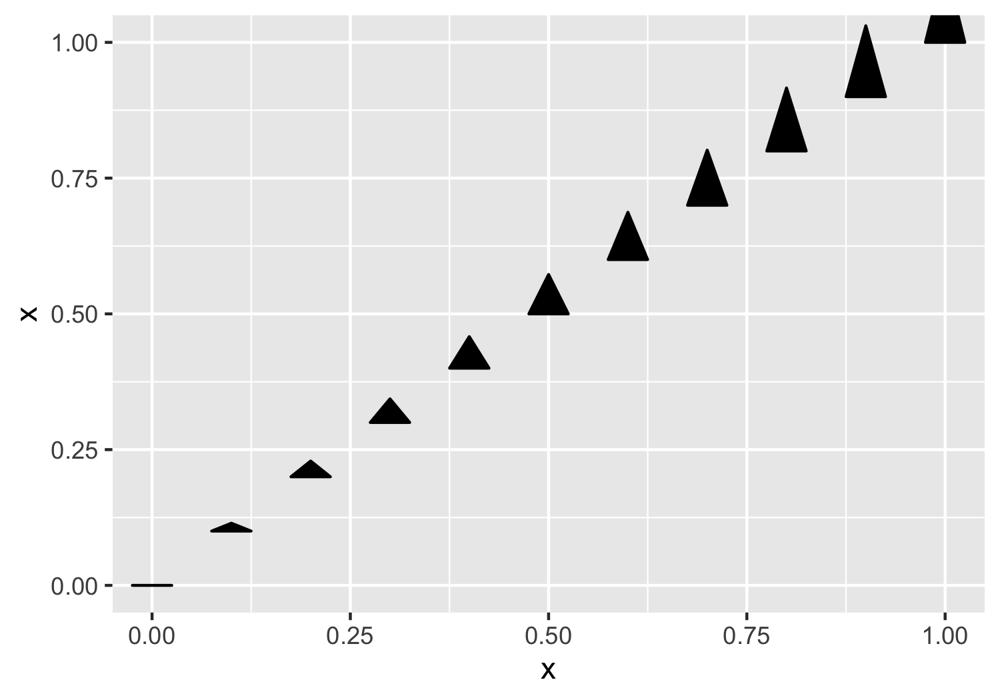

# ggtriangles

`ggtriangles` provides the `geom_triangles()` function which plots isoceles
triangles with a horizontal base centered at position `(x,y)` with height `z`.

**note:** ggtriangles is still under development.

### an example plot using ggtriangles

### to install

    devtools::install_github("ctesta01/ggtriangles")
    
### basic usage

    data.frame(x = 1:5) %>%
      ggplot(aes(x = x, y = x, z = x)) +
      geom_triangles()
     

### some more examples

### motivation

I originally created this because I wanted to be able to render something like
the NYTimes maps of where COVID-19 death rates had increased and decreased since
vaccines were widely made available to adults.

These maps were originally featured here: <https://www.nytimes.com/interactive/2021/12/28/us/covid-deaths.html> 

I spent some time re-creating something similar (though not exactly the
same) as the NYTimes analysis and graphic to demonstrate that functionality and
use-case for `ggtriangles`.

You can check out how I did it in the [`inst/recreate_nytimes_visualization_format.R`](inst/recreate_nytimes_visualization_format.R)
document. Note that these figures are provided purely as examples and not meant
for decision making purposes or scientific usage. 
