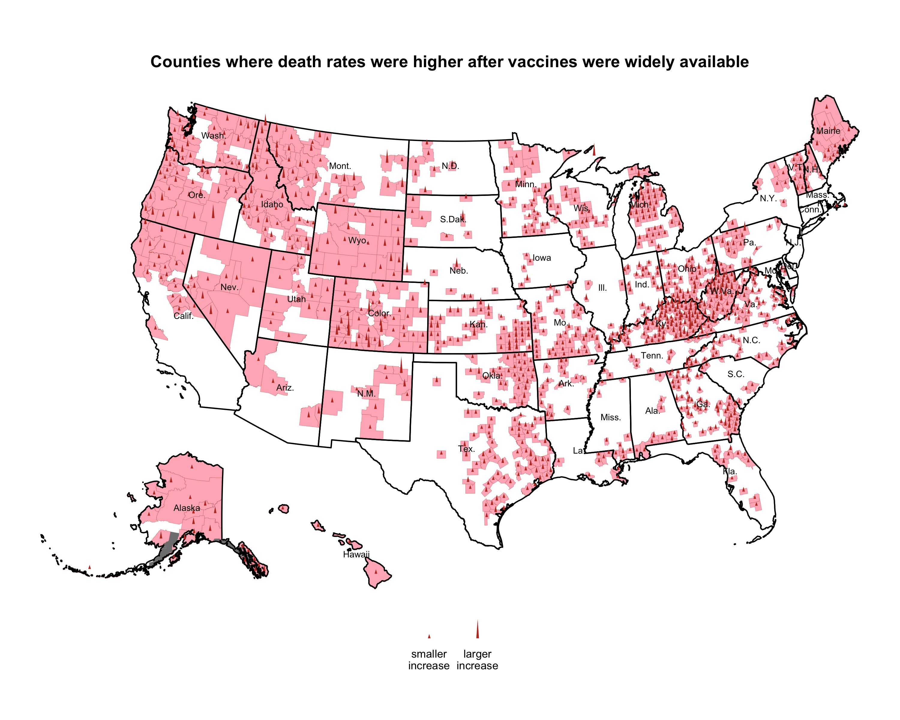

# ggtriangles

`ggtriangles` provides the `geom_triangles()` function which plots isoceles
triangles with a horizontal base centered at position `(x,y)` with height `z`.

**note:** ggtriangles is still under development.

### an example plot using ggtriangles

Here's the code: 

    library(ggtriangles)
    library(patchwork) # we're using patchwork to add the legend

    plt <- datasets::sleep %>% 
      ggplot(aes(x = ID, y = group, z = extra)) + 
      geom_triangles(width = 0.1, height_scale = 0.1) + 
      xlab("Individual") + 
      ylab("Drug Given") + 
      ggtitle("Data show the effects of two soporific drugs administered to a group of 10 people") + 
      labs(caption = "Data from datasets::sleep")
    
    legend <-
      draw_geom_triangles_size_legend(
      z_values = c(-max(sleep$extra), 0, max(sleep$extra)),
      height_scale = 0.1,
      width = 0.05,
      labels = c('decrease in\nsleep', 'no change', 'increase in\nsleep')
      )
    
    # we use a blank plot above and below the legend to make it take up 
    # less vertical space
    blank_plot <- ggplot() + theme_void()
    
    # compose our plot using patchwork
    (plt + (blank_plot / legend / blank_plot)) +
      plot_layout(ncol = 2, nrow = 1, widths = c(1, .25))

### to install

    devtools::install_github("ctesta01/ggtriangles")

### basic usage

    iris %>%
      ggplot(aes(x = Sepal.Length, y = Sepal.Width, z = Petal.Length)) +
      geom_triangles(width = 0.1, height_scale = 0.05)
      

### to add a legend

For now, I recommend using patchwork and combining your plots with a manually
constructed legend you can create using `geom_triangles` and `geom_text`.

A great addition to this project would be an improved `draw_key` for
`GeomTriangles`, but I have not made that addition yet.

    library(patchwork)

    z_values <- c(5,-.5,3,1.5,-7)/15

    plt <- ggplot(data.frame(x=1:5, y = 1:5, z = z_values), aes(x=x,y=y,z=z)) +
        geom_triangles(width = 0.1)

    legend <- draw_geom_triangles_size_legend(z_values = c(-5,0,5)/15, height_scale = 1.5, width = 0.1)

    blank_plot <- ggplot() + theme_void()

    (plt + (blank_plot / legend / blank_plot)) +
      plot_layout(ncol = 2, nrow = 1, widths = c(1, .25))

### motivation

I originally created this because I wanted to be able to render something like
the NYTimes maps of where COVID-19 death rates had increased and decreased since
vaccines were widely made available to adults.

These maps were originally featured here: <https://www.nytimes.com/interactive/2021/12/28/us/covid-deaths.html> 

I spent some time re-creating something similar (though not exactly the
same) as the NYTimes analysis and graphic to demonstrate that functionality and
use-case for `ggtriangles`.

You can check out how I did it in the [`inst/recreate_nytimes_visualization_format.R`](inst/recreate_nytimes_visualization_format.R)
document. Note that these figures are provided purely as examples and not meant
for decision making purposes or scientific usage. 
