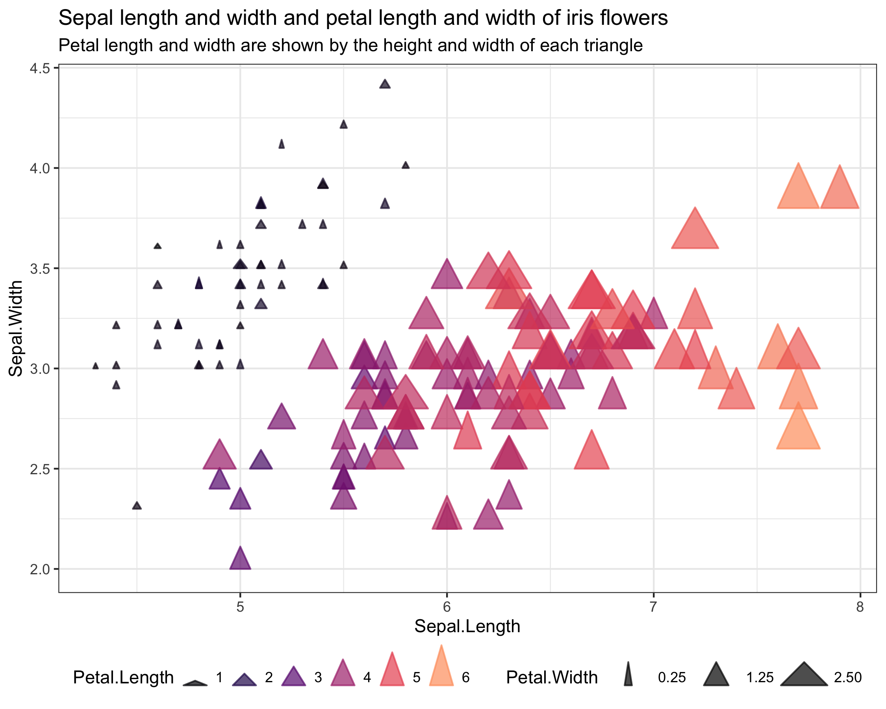
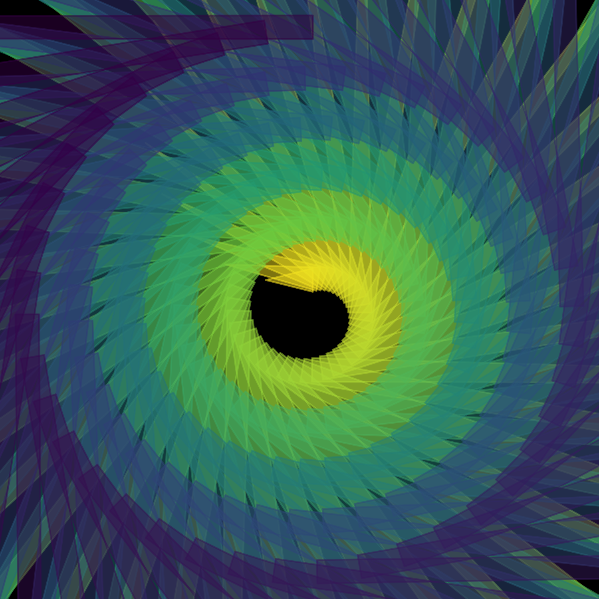
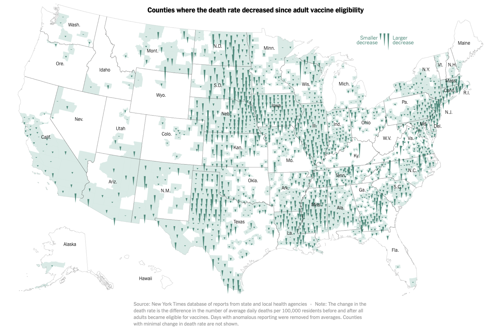

# ggtriangles

`ggtriangles` provides the `geom_triangles()` function which plots isosceles
triangles with their horizontal base centered at position `(x,y)` and variable
`triangle_height`, `triangle_width`, and `angle` as given by `aes()` arguments
in the `ggplot2` framework.

**note:** ggtriangles is still under development. 

### basic usage

    library(ggtriangles)
    data.frame(x = seq(0,1,.1)) %>%
      ggplot(aes(x = x, y = x, triangle_height = x)) +
      geom_triangles()

### to install

    devtools::install_github("ctesta01/ggtriangles")

### some example plots using ggtriangles

Read about how to make these in the `vignette('intro-to-ggtriangles')`.

### how to get started

Check out the examples available in the help pages by entering `?geom_triangles` into
R after you've loaded the package. Additionally, `vignette('intro-to-ggtriangles')`
has the code to produce the figures above.

I think ggtriangles will provide a nice interface both for Rtists who are
looking to incorporate triangles programmatically in their generative art, as
well as data visualization creators who are interested in using triangles'
position, height, width, color, and fill to communicate features of
their data.

### motivation

I originally created this because I wanted to be able to render something like
the NYTimes maps of where COVID-19 death rates had increased and decreased since
vaccines were widely made available to adults.

#### origianl nytimes version:

These maps were originally featured here: <https://www.nytimes.com/interactive/2021/12/28/us/covid-deaths.html> 

I spent some time re-creating something similar (though not exactly the
same) as the NYTimes analysis and graphic to demonstrate that functionality and
use-case for `ggtriangles`.

#### ggtriangles version:

You can check out how I did it in the vignette available through the vignette
available in 
`browseVignettes('ggtriangles')` or the source code,
[vignettes/recreating_nytimes_viz.Rmd](vignettes/recreating_nytimes_viz.Rmd).
Note that these figures are provided purely as examples and not meant for
decision making purposes or scientific usage.

### feedback

Please feel free to make suggestions and provide feedback on ggtriangles in an
issue on this GitHub repository.
